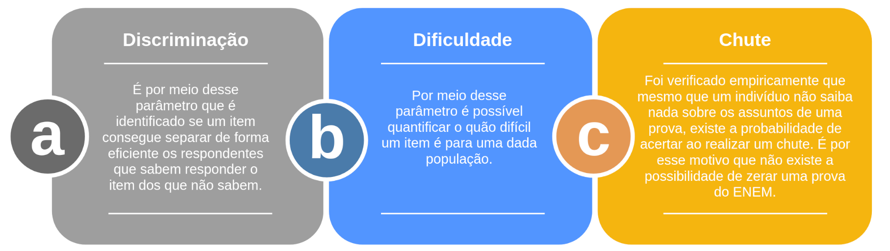
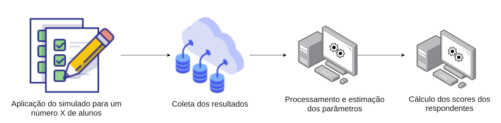

# O Problema?


Avaliar o quanto uma pessoa compreende um determinado assunto por meio de um teste não é tarefa fácil. Neste quesito alguns fatores precisam ser levados em consideração, como:

- A questão precisa conter informação suficiente para a pessoa tomar uma decisão.
- A questão precisa abordar um tópico que foi previamente explicado.
- Em questões múltipla escolha, como saber se a pessoa apenas tentou adivinhar a resposta?
- Questões mais difíceis deveriam pontuar mais?
- Como categorizar uma questão como díficil ou fácil?
- A pessoa precisa ter tempo hábil para responder todos os quesitos.

No intuito de tentar amenizar alguns desses problemas, tem-se adotado a **Teoria de Resposta ao Item**. Dessa forma é possível levar em consideração não apenas se a pessoa acertou ou errou a questão, mas também considerar a trajetória dela durante a prova.


## Mas o que é a Teria de Resposta ao Item?

Segundo uma conceituação dada pelos autores *Dalton*, *Heliton* e *Raquel*:

*"A Teoria de Resposta ao Item é uma metodologia de avaliação educacional que propõe a capacidade de avaliar traços latentes, ou seja, características do indivíduo que não podem ser medidas diretamente. A TRI é uma alternativa ao método clássico onde as notas são dadas baseadas apenas na quantidade de acertos e erros numa prova.*

*O que esta metodologia sugere são formas de representar a relação entre a probabilidade de um indivíduo dar uma certa resposta a uma questão e seus traços latentes, proficiências ou habilidades na área de conhecimento avaliada."*


# Aplicação Geral

A TRI possui uma aplicação bem geral, apesar de no Brasil ela ter se tornado mais conhecida por sua utilização no Exame Nacional do Ensino Médio (ENEM), ela é utilizada em outros exames **Nacionais** (SAEB e SARESP) e **Internacionais** (PISA, PIAAC, TIMSS). Além disso, a TRI também é utilizada em outras áreas que não seja educação, como:

- Psicologia
- Pesquisas na saúde
- Pesquisas de satisfação


# Aplicação ENEM

No escopo da TRI tem-se a existência de diferentes modelos matemáticos, onde cada um recomendado para um tipo de aplicação, no entanto, foge ao escopo desse artigo a explicação matemática de cada um deles, se você tiver interesse em estudar com mais detalhes sobre a teoria envolvida, ao final do artigo serão adicionadas algumas referências.

Dentre os modelos mais comuns utilizados estão:

1. **Dicotômicos:**

- *Rash Models*
- *2PL e 3PL*

1. **Politômicos:**

- *Partial Credit Models*
- *Graded Response Model*
- *Rating Scale Model*

A nível de esclarecimento, os dicotômicos estão relacionados à questões onde a existe apenas a possibilidade de acertar ou errar. Já nos politômicos as questões possuem uma graduação de intensidade nas possíveis respostas, como por no exemplo abaixo:

1. *Qual o nível de satisfação com a empresa que está trabalhando?*

- *Muito insatisfeito*
- *Insatisfeito*
- *Satisfeito*
- *Muito satisfeito*


# Conceito

Iremos focar aqui no modelo 3PL, _modelo de três parâmetros_, pois o mesmo foi utilizado na implementação que realizamos. Nesse modelo matemático são considerados três fatores que estão envolvidos na resolução de um item (entenda a utlização do termo **item** como **questão** de uma prova ou simulado).



## Modelo 3PL

Apenas a nível de curiosidade, o modelo 3PL é equacionado da seguinte forma:

$$
P(U_{i, j} = 1 | \theta_{j},a_{i},b_{i},c_{i}) = c_{i} + (1 - c_{i})\frac{e^{a_{i}(\theta_{j} - b_{i})}}{1 + e^{a_{i}(\theta_{j} - b_{i})}}
$$


Calma, o intuito de apresentar esta fórmula é apenas o de localiza-los onde cada um dos parâmetros é utilizado. 

De forma simples, o que essa equação está nos dizendo é a probabilidade de um respondente acertar um item dado todos os parâmetros citados anteriormente e mais a habilidade do indivíduo.

Um ponto que você deve estar se perguntando é: *Como eu vou determinar todos esses parâmetros para um item que nunca foi aplicado?*

A seguir, no exemplo, nós poderemos ver na prática como isso é feito, mas de antemão o que acontece é uma estimativa baseando-se nas respostas dos próprios respondentes. Veja a imagem abaixo que ilustra melhor o que acontece.





# Implementação

Efetuar a estimação dos parâmetros seria impraticável utilizando caneta e papel, dessa forma nós utilizamos uma lib em `R` chamada `MIRT`, bem consolidada entre estatísticos usuários da TRI. Ela nos ajudará a encontrar os parâmetros: a, b e c para cada item em nossa prova e a determinar as habilidades dos respondentes.

Para mais detalhes sobre o [MIRT](https://www.rdocumentation.org/packages/mirt/versions/1.34)~ por favor visite a documentação, é possível encontrar também um [artigo](https://www.jstatsoft.org/article/view/v048i06) que trata sobre a implementação do mesmo.


# Pontos para ficar atento


Alguns pontos são extremamente importantes de levar em consideração na hora de realizar uma correção de um simulado pela TRI:

1. **Amostragem**

Procure entender se seu simulado terá dados suficientes para estimação dos parâmetros. Essa é uma tarefa difícil pois não possuímos uma fórmula mágica para tomar essa decisão, porém um consenso citado entre diferentes artigos é que entre 200 e 250 respondentes para um simulado de 45 items é um número interessante para chegar a valores confiáveis dos parâmetros. Quanto mais items, mais respondentes precisaremos.

Além disso, como nós utilizamos a própria amostra para estimação dos parâmetros, a mesma precisa ser o mais representativa possível da população que está sendo trabalhada.

1. **Escala utilizada**

A escala utilizada pelo ENEM tem um range de aproximadamente 0 até aproximadamente 1000. É possível garantir esse intervalo pois o MEC possui estudo muito rigoroso entre os items e estimativa dos parâmetros. Quando tal estudo não é realizado se torna impossível garantir um mínimo e um máximo para o intervalo, e no máximo conseguimos adotar um valor médio e um desvio padrão ao qual os scores serão calculados.

1. **Ordem dos items**

Em alguns casos, a ordem dos items pode influenciar no score do respondente. Alguns estudos mostram que items localizados mais ao final da prova/simulado tem maior probabilidade de error. Isso acontence por características empíricas do próprio indivíduo que tende a aprensetar um cansaço físico no decorrer do tempo e do simulado.

No entanto, tal parâmetro possui um peso pequeno no resultado final, ficando a cargo do professor em como distribuir melhor seus items numa prova.


# Análise e Resultados

Aqui iremos trazer uma análise para um case de um simulado realizado por um de nossos clientes. Foram 95 items e 2460 respondentes para esse simulado.


# Libs

```{r}
library(ltm)
library(irtoys)
library(mirt)
library(CTT)
library(tidyverse)
library(patchwork)
```


```{r}
# dados de humanas
day_1_lenguages_humans_science_str <- sprintf("item_%s", seq(1:95))
day_1_lenguages_humans_science_raw_tbl <- read_csv("data/enem_dia1_linguagem_ciencias_humanas.csv")
day_1_lenguages_humans_science_tbl <- day_1_lenguages_humans_science_raw_tbl %>% 
  separate(results, into = day_1_lenguages_humans_science_str, sep = ",") %>% 
  rename(student_code = systemUserId,
         activity_code = examId) %>% 
  mutate_all(funs(type.convert(as.integer(.))))
  

day_1_lenguages_humans_science_final_tbl <- day_1_lenguages_humans_science_tbl %>% 
  dplyr::select(starts_with("item"))

# salvando a lista de ids dos estudantes
student_vect <- day_1_lenguages_humans_science_tbl %>% 
  pluck(2)

# salvando o código da atividade
activity_code <- day_1_lenguages_humans_science_tbl %>% 
  pluck(1)

```


Dessa forma nosso dataframe está pronto para ser utilizado na modelagem. Cada coluna possui um item e cada linha é uma resposta para o item feita por um aluno individual.

A modelagem é feita utilizando o modelo 3PL para estimação dos parâmetros. Passamos os dados, indicamos que é um problema dicotômico e também o tipo de modelo que desejamos.

```{r}
mymodel <- mirt(
  day_1_lenguages_humans_science_final_tbl, 
  1,          
  itemtype = '3PL')

```

O output do modelo indica uma convergência do modelo em 250 iterações, com um Max-Change de 0.00010. O que indica que houve uma estabilização para cada estimativa nessa escala. 

Dando um print no modelo, nós podemos obter mais parâmetros sobre o modelo, como o optimizer utilizado na simulação e a quantidade estimada de parâmetros, que aqui foi de 285.

Podemos acessar os scores latentes dos items por meio de uma função do pacote do MIRT.

```{r}
latent_answers <- as.vector(fscores(mymodel))
```

```{r}
irt_coefs <- coef(mymodel, simplify = T, IRTpars =T)
```

Utilizando essa função nós conseguimos transformar os scores para uma nova escala que possui média 500 e desvio de 100.

```{r}
novo_score <- score.transform(
  latent_answers, mu.new = 500, sd.new = 100,
  normalize = FALSE
)
```


```{r}
# data transformations
my_data_column_names <- names(day_1_lenguages_humans_science_final_tbl)

irt_coefs_tbl <- irt_coefs$items %>% 
  as_tibble()

max_n = dim(day_1_lenguages_humans_science_final_tbl[][1])[1]

# student_vect <- 1:max_n
day_1_lenguages_humans_science_final_tbl["student_code"] <- student_vect
irt_coefs_tbl["item"] <- my_data_column_names

mydata_longer <- day_1_lenguages_humans_science_final_tbl %>% 
  pivot_longer(cols = -student_code, names_to = "items", values_to = "count")

score_14_students <- novo_score[1]$new.scores[1:max_n]

scores_tbl <- enframe(score_14_students) %>% 
  rename(student_id = name,
         score = value) %>% 
  mutate(student_id = as_factor(student_vect))

# scores_tbl to export
file_name  <- paste0(as.character(activity_code[1]), "_activiy.csv")
scores_tbl %>% 
  arrange(desc(score)) %>% 
  bind_cols("activity_code" = activity_code) %>% 
  write_csv(file_name)

```


```{r}
# adjust color and axis
p1 <- mydata_longer %>% 
  filter(student_code %in% c(1:19)) %>% 
  mutate(items = as_factor(items)) %>% 
  ggplot(aes(x = items,
             y = student_code,
             fill = count == 1)) +
  geom_raster() +
  scale_fill_manual(values = c("#e0e0e0", "orange")) +
  scale_y_discrete(name="Students", limits=c(1:19)) +
  theme_minimal() +
  theme(
    axis.text.x = element_text(angle=45)
  )


p2 <- scores_tbl %>% 
  mutate(student_id = student_id %>% as_factor()) %>% 
  arrange(desc(score)) %>% 
  top_n(10) %>% 
  ggplot(aes(x = score,
             y = student_id %>% fct_reorder(score))) + 
  geom_bar(stat="identity", width=.7, fill="orange") +
  labs(
    title = "Classfication by score",
    y = "Students IDs",
    x = "Scores"
  ) +
  theme_minimal() 


p3 <- mydata_longer %>% 
  # filter(student_code %in% c(1:max_n)) %>% 
  group_by(student_code) %>% 
  summarise(total_corrects = sum(count)) %>% 
  ungroup() %>%
  arrange(desc(total_corrects)) %>% 
  top_n(10) %>% 
  mutate(student_code = as_factor(student_code)) %>% 
  ggplot(aes(x = total_corrects,
             y = student_code %>% fct_reorder(total_corrects))) +
  geom_bar(stat="identity", width = .7, fill="orange") +
  labs(
    x = "Quantity of Correct Answer",
    y = "",
    title = "Classification by correct answers"
  ) +
  theme_minimal()

p4 <- irt_coefs_tbl %>% 
  dplyr::select(-c(u, a, g)) %>%
  mutate(item = as_factor(item)) %>% 
  # filter(item != "item_3") %>% 
  ggplot(aes(x = b,
             y = item %>% fct_reorder(b))) +
  geom_bar(stat="identity", width = .7, fill = "orange") +
  theme_minimal() +
  labs(
    x = "b = Difficulty",
    y = "Items",
    title = "Items by order of difficulty"
  )

p2 | p3
```


# Possibilidades Futuras